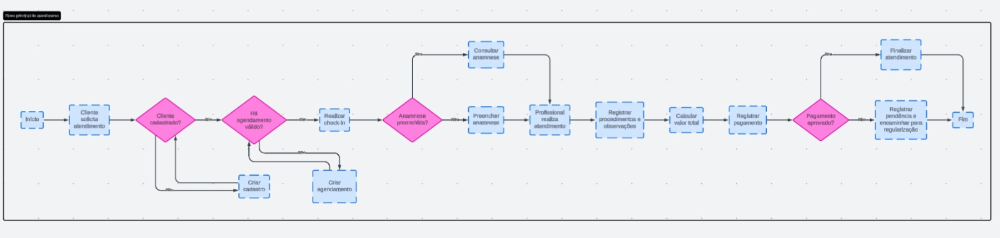

# Projeto ERP — PODOLOGIA TATUAPE

## 1. Identificação da equipe

* Arthur Alves de Souza Rocha — RGM: 47606762
* Bruna Santos Dias — RGM: 48293237
* Davi de Almeida Pereira — RGM: 47488891
* Eduardo de Abreu — RGM: 47478497
* Guilherme Jussek Nogueira — RGM: 47392657
* Henry Soave Bailer — RGM: 46977244
* Julia Lindsay da Silva — RGM: 47396407
* Nicolas Gabriel Parris Reis — RGM: 47646691
* Paulo Alexandre Ferreira Martins — RGM: 48606341
* Sabrina Hadassa Gomes de Andrade — RGM: 47817593
* Yasmin da Silva Pinheiro — RGM: 49842013

## 2. Caracterização da empresa

- **Nome:** PODOLOGIA TATUAPE
- **Segmento:** Serviço
- **Porte:** Microempresa
- **Atividade principal:** Podologia

A empresa oferece tratamentos para unhas encravadas, calos e calosidades, fissuras e rachaduras, micoses e frieiras, verrugas plantares, corte técnico e cuidados especiais.

## 3. Justificativa da escolha

Escolhemos a empresa por conta da oportunidade. Identificamos que a empresa tem dificuldades com administração de clientes, horários e podólogas. Com base nessas informações, projetamos uma solução para essa empresa através da modelagem de banco de dados.

## 4. Problemas identificados

* Controle de agendamentos feito manualmente;
* Possibilidade de conflito de horários;
* Dificuldade no controle dos clientes;
* Dificuldade no controle dos funcionários;
* Necessidade de organizar os atendimentos;
* Necessidade de registrar o histórico dos clientes;
* Necessidade de controlar os procedimentos realizados;
* Necessidade de registrar os pagamentos.

## 5. Processos de negócio

### Agendamento

Cliente → Agendar → Atendimento → Pagamento

### Atendimento

Cliente → Avaliação → Anamnese → Atendimento → Procedimento

### Cadastro do cliente

Cliente → Cadastro

### Realização do procedimento

Cliente → Atendimento → Funcionário → Procedimento

### Pagamento

Cliente → Atendimento → Procedimento → Pagamento → Registro do pagamento

### Avaliação

Cliente → Avaliação → Queixa principal → Observações → Atendimento

## 6. Requisitos funcionais

Em desenvolvimento.

## 7. Requisitos não funcionais

* **RNF01 – Segurança:** somente usuários autorizados poderão acessar as informações do sistema.
* **RNF02 – Privacidade:** os dados pessoais e informações dos clientes deverão ser mantidos em sigilo.
* **RNF03 – Usabilidade:** o sistema deverá possuir uma interface simples e fácil de utilizar pelos funcionários.
* **RNF04 – Desempenho:** o sistema deverá apresentar as informações e realizar as operações em tempo adequado.
* **RNF05 – Integridade:** o sistema deverá manter os dados cadastrados corretos e evitar registros inconsistentes.
* **RNF06 – Disponibilidade:** o sistema deverá estar disponível durante o horário de funcionamento da empresa.
* **RNF07 – Backup:** os dados deverão possuir cópias de segurança para evitar perda de informações.
* **RNF08 – Controle de acesso:** cada usuário deverá acessar somente as funcionalidades e informações necessárias para sua função.

## 8. Regras de negócio

Em desenvolvimento.

## 9. Restrições e políticas organizacionais

* Os dados dos clientes devem ser mantidos em sigilo.
* Somente usuários autorizados podem acessar as informações.
* Cada cliente deve possuir um cadastro único.
* O CPF não deve ser duplicado entre clientes.
* Os registros dos atendimentos devem ser armazenados corretamente.
* As informações de avaliação devem ser registradas antes do atendimento.
* O status de Agendar deve representar corretamente a situação do atendimento.
* As informações de pagamento devem estar relacionadas ao atendimento correspondente.

## 10. Fluxogramas

### Fluxograma do principal acesso

## 11. Entidades

* Pessoa
* Cliente
* Funcionário
* Agendar
* Atendimento
* Anamnese
* Avaliação
* Procedimento
* Executa
* Pagamento

## 12. Atributos

Em desenvolvimento.

## 13. Relacionamentos

Em desenvolvimento.

## 14. Cardinalidades

Em desenvolvimento.

## 15. Dicionário de dados conceitual

Em desenvolvimento.

## 16. DER

Em desenvolvimento.

## 17. Justificativas técnicas

Em desenvolvimento.

## 18. Conclusão

O desenvolvimento deste projeto ajudou a equipe a entender melhor como funciona a modelagem de dados partindo de uma situação real. Ao analisar nosso projeto, percebemos que antes de pensar no banco de dados é necessário entender como a empresa funciona, quais problemas existem e quais informações precisam ser organizadas.

Durante o projeto, aprendemos principalmente a transformar essas informações em uma estrutura mais organizada, identificando entidades, atributos, relacionamentos e regras de negócio. Também foi importante entender que uma decisão feita em uma parte da modelagem pode influenciar as outras, por isso é necessário analisar cada etapa com atenção. Com isso, o projeto ajudou a desenvolver não só o conhecimento sobre modelagem de dados, mas também uma visão mais prática de como um banco de dados pode ser planejado para atender às necessidades de uma empresa.

